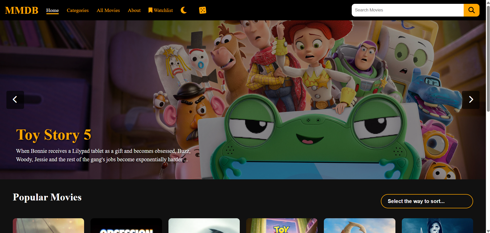

# 🎬 MMDB (My Movie Database)

A responsive, feature-rich web application that allows users to discover popular movies, search for specific titles, and manage a personal watchlist. Powered by the TMDB (The Movie Database) API.

 

## Features

* **Dynamic Movie Discovery:** Fetches and displays real-time popular movies using the TMDB API.
* **Interactive Hero Slider:** An auto-playing hero banner highlighting top movies, complete with manual navigation controls.
* **Smart Search:** Live, "as-you-type" search bar with a floating dropdown menu and keyboard navigation (Arrow keys & Enter).
* **Advanced Sorting:** Filter the movie grid by Rating (High → Low), Release Date (Newest → Oldest), or Title (A → Z).
* **Persistent Watchlist:** Add or remove movies to a personal watchlist. Data is saved to the browser's `localStorage` so it persists even after closing the tab.
* **Split-Layout Dashboard:** A sleek CSS Grid layout featuring the movie catalog on the left and sticky watchlist statistics on the right.
* **Light/Dark Mode Toggle:** Seamless theme switching with user preferences saved locally.
* **Random Movie Generator:** A fun "dice roll" feature that fetches a completely random popular movie recommendation.
* **Sleek UI/UX Elements:** Features a one-time splash loading screen, smooth hover animations, dynamic toast notifications, and responsive mobile design.


## Technologies Used
* **HTML5:**  Uses a semantic HTML structure with reusable components like slide.html and floatingresults.html
* **CSS3:** Custom styling using CSS Grid for the layout, Flexbox, CSS variables, modern hover/overlay transitions and creating a consistent theme
* **JavaScript (Vanilla ES6+):** API fetching (`async/await`),DOM manipulation,event handling and local storage management
* **TMDB API:** API integration for fetching movie data, posters, and search
* **AI:** Used gemini for understand and implementing new concepts to me
* **Youtube:** To learn new features to add up in webpage

### Prerequisites
* A modern web browser
* A code editor like VS Code


### Installation
1. **Clone the repository:**

- Repository: https://github.com/Parth1243/MMDB

```bash
git clone https://github.com/Parth1243/MMDB.git
```

2. **Open the project:**
- Extract and Simply open the webs.html file in your web browser (no use of node.js etc)
- Might have to use VPN


## My Remarks
- I am not an expert in JS yet, but I strive to improve my skills every day. For some of the logic, I learned and implemented solutions with the help of YouTube videos and AI assistants.
- The categories section is still incomplete due to some urgent work. In the remaining time, I focused on improving the project, refining a few features, and publishing it on GitHub.
- I also added a randomizer feature, which can be helpful for users who are unsure about which movie to watch.
- I hope you enjoy my project and its overall theme.
- If possible please try to use VPN if nothing is loading as on my network it worked on VPN only
